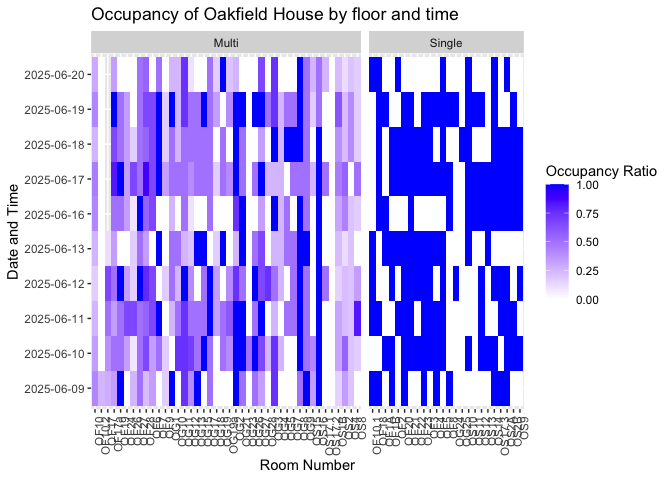
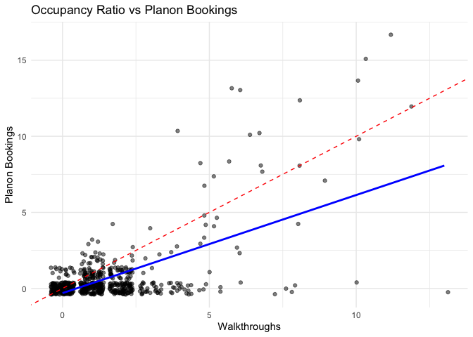

# Analysis of space audit data
Gibran Hemani
2025-06-26

# Analysis of space audit data

For three weeks from early June a space audit was conducted at 1-5WLR,
OH and CH. The purpose of the space audit was to record which areas were
being used, how they were being used and when.

Data was collected with

- door sheets, aimed to collect how the office was being used
- walkthroughs, where someone counted how many people were in each
  office space 3 times a day
- Planon records

The main objective of this analysis is to estimate how many offices will
be required at Augustine’s Court based on current usage.

There are some limitations with the data.

Door sheets - Quite incomplete. If we analyse all door data it will be
an underestimate of office usage. If we restrict to only offices with
data it will be an overestimate. - Incomplete data about types of
meetings - Some data didn’t record dates etc.

Walkthroughs - Didn’t record type of activities in the offices
especially if meeting rooms were used for video calls. - Is a sample
which may not be representative of the whole day.

Planon records - Many people don’t use these data - Bookings were often
not confirmed, which may indicate that the office was not used or could
just be because it’s too onerous to confirm a booking.

## Analysis

### Exploration

Load libraries

``` r
library(dplyr)
```


    Attaching package: 'dplyr'

    The following objects are masked from 'package:stats':

        filter, lag

    The following objects are masked from 'package:base':

        intersect, setdiff, setequal, union

``` r
library(readxl)
library(ggplot2)
library(lubridate)
```


    Attaching package: 'lubridate'

    The following objects are masked from 'package:base':

        date, intersect, setdiff, union

``` r
library(tidyr)
library(here)
```

    here() starts at /Users/gh13047/repo/phs-space-audit

``` r
library(purrr)
```

Read in the Oakfield House walkthrough data - Convert to long format -
Remove “NOT IN USE” values - Extract date and time from the name
column - Extract max number of people for each room

``` r
expand.grid(floor=c("GF","1st", "2nd"), week=c(1,2)) %>% mutate(sheet_name = paste0(floor, " Week ", week)) %>%
    purrr::pmap(., function(floor, week, sheet_name) {
      read_xlsx(here("data/Oakfield House June 2025 for sharing.xlsx"), sheet = sheet_name, skip=1) %>%
        pivot_longer(cols=-c("ROOM NUMBERS", "USE")) %>%
        filter(value != "NOT IN USE", !is.na(`ROOM NUMBERS`)) %>%
        mutate(
            max_number=as.numeric(gsub("[^0-9]", "", USE)), 
            week=week, 
            floor=floor, 
            value=as.numeric(value),
            name=gsub("3.00", "15.00", name) %>% gsub("09.30", "10.00", .) %>% gsub("\\.", ":", .),
            datetime=as.POSIXct(name, format="%d/%m/%Y %H:%M"),
            date=as.Date(datetime, format="%d/%m/%Y"),
            time=format(datetime, "%H:%M"),
            day=wday(datetime, label=TRUE)
        ) %>%
        filter(!`ROOM NUMBERS` %in% c("TOTALS", "multi occupancy space", "Single occupancy office", "Meeting space", ""), !grepl("Meeting", `ROOM NUMBERS`))
    }) %>% bind_rows -> oh_wt
oh_wt %>% str
```

    tibble [2,034 × 11] (S3: tbl_df/tbl/data.frame)
     $ ROOM NUMBERS: chr [1:2034] "OG1" "OG1" "OG1" "OG1" ...
     $ USE         : chr [1:2034] "4 person office" "4 person office" "4 person office" "4 person office" ...
     $ name        : chr [1:2034] "9/6/2025 10:00" "9/6/2025 12:00" "9/6/2025 15:00" "10/6/2025 10:00" ...
     $ value       : num [1:2034] 0 4 1 0 0 0 1 1 0 1 ...
     $ max_number  : num [1:2034] 4 4 4 4 4 4 4 4 4 4 ...
     $ week        : num [1:2034] 1 1 1 1 1 1 1 1 1 1 ...
     $ floor       : Factor w/ 3 levels "GF","1st","2nd": 1 1 1 1 1 1 1 1 1 1 ...
     $ datetime    : POSIXct[1:2034], format: "2025-06-09 10:00:00" "2025-06-09 12:00:00" ...
     $ date        : Date[1:2034], format: "2025-06-09" "2025-06-09" ...
     $ time        : chr [1:2034] "10:00" "12:00" "15:00" "10:00" ...
     $ day         : Ord.factor w/ 7 levels "Sun"<"Mon"<"Tue"<..: 2 2 2 3 3 3 4 4 4 5 ...

``` r
table(is.na(oh_wt$max_number))
```


    FALSE  TRUE 
     1976    58 

``` r
table(is.na(oh_wt$value))
```


    FALSE 
     2034 

Make a heatmap of the occupancy of Oakfield House by floor and time

``` r
oh_wt %>% filter(!is.na(max_number)) %>%
    mutate(
        occupancy_ratio=pmin(value/max_number, 1),
        office_type=ifelse(max_number == 1, "Single", "Multi")
    ) %>%
ggplot(., aes(y=as.factor(datetime), x=`ROOM NUMBERS`, fill=occupancy_ratio)) +
  geom_tile() +
  facet_grid(. ~ office_type, scale="free_x", space="free_x") +
  scale_fill_gradient(low = "white", high = "blue") +
  labs(title="Occupancy of Oakfield House by floor and time",
       y="Date and Time",
       x="Room Number",
       fill="Occupancy Ratio") +
       theme(axis.text.x = element_text(angle = 90, hjust = 1))
```


By date

``` r
oh_wt %>% group_by(date, `ROOM NUMBERS`, floor) %>%
    summarise(
        max_number=mean(max_number, na.rm=TRUE),
        value=max(value, na.rm=TRUE),
        occupancy_ratio=pmin(value/max_number, 1),
        office_type=ifelse(max_number == 1, "Single", "Multi")
    ) %>%
    filter(!is.na(occupancy_ratio)) %>%
    ggplot(., aes(y=as.factor(date), x=`ROOM NUMBERS`, fill=occupancy_ratio)) +
        geom_tile() +
        facet_grid(. ~ office_type, scale="free_x", space="free_x") +
        scale_fill_gradient(low = "white", high = "blue") +
        labs(title="Occupancy of Oakfield House by floor and time",
            y="Date and Time",
            x="Room Number",
            fill="Occupancy Ratio") +
       theme(axis.text.x = element_text(angle = 90, hjust = 1))
```

    `summarise()` has grouped output by 'date', 'ROOM NUMBERS'. You can override
    using the `.groups` argument.



By day of week

``` r
oh_wt %>% group_by(day, `ROOM NUMBERS`, floor) %>%
    summarise(
        max_number=mean(max_number, na.rm=TRUE),
        value=mean(value, na.rm=TRUE),
        occupancy_ratio=pmin(value/max_number, 1),
        office_type=ifelse(max_number == 1, "Single", "Multi")
    ) %>%
    filter(!is.na(occupancy_ratio)) %>%
    ggplot(., aes(y=day, x=`ROOM NUMBERS`, fill=occupancy_ratio)) +
        geom_tile() +
        facet_grid(. ~ office_type, scale="free_x", space="free_x") +
        scale_fill_gradient(low = "white", high = "blue") +
        labs(title="Occupancy of Oakfield House by floor and time",
            y="Date and Time",
            x="Room Number",
            fill="Occupancy Ratio") +
        theme(axis.text.x = element_text(angle = 90, hjust = 1))
```

    `summarise()` has grouped output by 'day', 'ROOM NUMBERS'. You can override
    using the `.groups` argument.


``` r
oh_wt %>% 
    group_by(time, `ROOM NUMBERS`, floor) %>%
    summarise(
        max_number=mean(max_number, na.rm=TRUE),
        value=mean(value, na.rm=TRUE),
        occupancy_ratio=pmin(value/max_number, 1),
        office_type=ifelse(max_number == 1, "Single", "Multi")
    ) %>%
    filter(!is.na(occupancy_ratio)) %>%
    ggplot(., aes(y=time, x=`ROOM NUMBERS`, fill=occupancy_ratio)) +
        geom_tile() +
        facet_grid(. ~ office_type, scale="free_x", space="free_x") +
        scale_fill_gradient(low = "white", high = "blue") +
        labs(title="Occupancy of Oakfield House by floor and time",
            y="Date and Time",
            x="Room Number",
            fill="Occupancy Ratio") +
        theme(axis.text.x = element_text(angle = 90, hjust = 1))
```

    `summarise()` has grouped output by 'time', 'ROOM NUMBERS'. You can override
    using the `.groups` argument.


How many meeting rooms do we need?

To work this out

- For any date/time, find out how many single ocupancy offices or
  multi-occupancy meeting rooms are occupied
- Need a list of rooms to be used
- Ignore the staff room, seminar room

``` r
meeting_romms <- c("OG18","OG19a","OF1A","OF1B","OF2","OF3","OF4","OF5","OF6","OF7","OF8","OF9","OF10.1","OF10.2","OF18","OF19","OF20","OF21","OF22","OF23","OF24","OF26","OF27","OS2A","OS2B","OS9","OS10","OS11","OS12","OS13","OS14","OS15","OS16","OS17.1","OS17.2","OS17.3")

of_wt_mr <- subset(oh_wt, `ROOM NUMBERS` %in% meeting_romms)

of_wt_mr %>%
    mutate(
        in_use=as.numeric(value > 0)
    ) %>%
    group_by(datetime, day, time, date) %>%
    summarise(
        in_use=sum(in_use, na.rm=TRUE),
        in_use_multiple=sum(value > 1, na.rm=TRUE)
    ) %>%
    ggplot(., aes(x=time, y=in_use)) +
        geom_bar(stat="identity") +
        geom_label(aes(label=in_use), size=3, vjust=-0.5) +
        facet_grid(. ~ date, ) +
        theme(axis.text.x = element_text(angle = 90, hjust = 1)) +
        scale_y_continuous(breaks=seq(0, 35, 1), limits=c(0, 35)) +
        labs(title="Number of meeting rooms in use at Oakfield House",
            y="Number of meeting rooms in use",
            x="Time")
```

    `summarise()` has grouped output by 'datetime', 'day', 'time'. You can override
    using the `.groups` argument.


In use with multiple people

``` r
of_wt_mr %>%
    mutate(
        in_use=as.numeric(value > 0)
    ) %>%
    group_by(datetime, day, time, date) %>%
    summarise(
        in_use=sum(in_use, na.rm=TRUE),
        in_use_multiple=sum(value > 1, na.rm=TRUE)
    ) %>%
    ggplot(., aes(x=time, y=in_use_multiple)) +
        geom_bar(stat="identity") +
        geom_label(aes(label=in_use_multiple), size=3, vjust=-0.5) +
        facet_grid(. ~ date, ) +
        theme(axis.text.x = element_text(angle = 90, hjust = 1)) +
        scale_y_continuous(breaks=seq(0, 35, 1), limits=c(0, 35)) +
        labs(title="Number of meeting rooms in use at Oakfield House multiple occupancy",
            y="Number of meeting rooms in use by more than one person",
            x="Time")
```

    `summarise()` has grouped output by 'datetime', 'day', 'time'. You can override
    using the `.groups` argument.


How many people are in these meeting rooms?

``` r
of_wt_mr %>% group_by(Occupancy=value) %>%
    summarise(n=n())
```

    # A tibble: 7 × 2
      Occupancy     n
          <dbl> <int>
    1         0   641
    2         1   310
    3         2   108
    4         3    13
    5         4     3
    6         5     2
    7         8     2

Can we pack the meetings into fewer rooms?

- Take 2025-06-17, largest number of meetings

``` r
of_top <- subset(of_wt_mr, date == "2025-06-17")

of_top %>%
    ggplot(., aes(x=time, y=`ROOM NUMBERS`, fill=value)) +
    geom_tile() +
    scale_fill_gradient(low = "white", high = "blue")
```


``` r
of_bot <- subset(of_wt_mr, date == "2025-06-13")

of_bot %>%
    ggplot(., aes(x=time, y=`ROOM NUMBERS`, fill=value)) +
    geom_tile() +
    scale_fill_gradient(low = "white", high = "blue")
```


## Look at door data

``` r
library(janitor)
```


    Attaching package: 'janitor'

    The following objects are masked from 'package:stats':

        chisq.test, fisher.test

``` r
oh_ds <- read_xlsx(here("data/Oakfield House June 2025 Door sheet data.xlsx"), sheet="NEW FORMAT") %>%
    janitor::clean_names() %>%
    filter(!is.na(type))
```

    Warning: Expecting numeric in B2 / R2C2: got a date

    Warning: Expecting numeric in B3 / R3C2: got a date

    Warning: Expecting numeric in B4 / R4C2: got a date

    Warning: Expecting numeric in B5 / R5C2: got a date

    Warning: Expecting numeric in B6 / R6C2: got a date

    Warning: Expecting numeric in B7 / R7C2: got a date

    Warning: Expecting numeric in B8 / R8C2: got a date

    Warning: Expecting numeric in B9 / R9C2: got a date

    Warning: Expecting numeric in B10 / R10C2: got a date

    Warning: Expecting numeric in B13 / R13C2: got a date

    Warning: Expecting numeric in B14 / R14C2: got a date

    Warning: Expecting numeric in B15 / R15C2: got a date

    Warning: Expecting numeric in B16 / R16C2: got a date

    Warning: Expecting numeric in B17 / R17C2: got a date

    Warning: Expecting numeric in B18 / R18C2: got a date

    Warning: Expecting numeric in B19 / R19C2: got a date

    Warning: Expecting numeric in B20 / R20C2: got a date

    Warning: Expecting numeric in B21 / R21C2: got a date

    Warning: Expecting numeric in B22 / R22C2: got a date

    Warning: Expecting numeric in B23 / R23C2: got a date

    Warning: Expecting numeric in B24 / R24C2: got a date

    Warning: Expecting numeric in B25 / R25C2: got a date

    Warning: Expecting numeric in B26 / R26C2: got a date

    Warning: Expecting numeric in B27 / R27C2: got a date

    Warning: Expecting numeric in B28 / R28C2: got a date

    Warning: Expecting numeric in B29 / R29C2: got a date

    Warning: Expecting numeric in B30 / R30C2: got a date

    Warning: Expecting numeric in B31 / R31C2: got a date

    Warning: Expecting numeric in B32 / R32C2: got a date

    Warning: Expecting numeric in B33 / R33C2: got a date

    Warning: Expecting numeric in B34 / R34C2: got a date

    Warning: Expecting numeric in B35 / R35C2: got a date

    Warning: Expecting numeric in B36 / R36C2: got a date

    Warning: Expecting numeric in B37 / R37C2: got a date

    Warning: Expecting numeric in B38 / R38C2: got a date

    Warning: Expecting numeric in B39 / R39C2: got a date

    Warning: Expecting numeric in B40 / R40C2: got a date

    Warning: Expecting numeric in B41 / R41C2: got a date

    Warning: Expecting numeric in B42 / R42C2: got a date

    Warning: Expecting numeric in B43 / R43C2: got a date

    Warning: Expecting numeric in B44 / R44C2: got a date

    Warning: Expecting numeric in B45 / R45C2: got a date

    Warning: Expecting numeric in B46 / R46C2: got a date

    Warning: Expecting numeric in B47 / R47C2: got a date

    Warning: Expecting numeric in B48 / R48C2: got a date

    Warning: Expecting numeric in B49 / R49C2: got a date

    Warning: Expecting numeric in B50 / R50C2: got a date

    Warning: Expecting numeric in B51 / R51C2: got a date

    Warning: Expecting numeric in B52 / R52C2: got a date

    Warning: Expecting numeric in B53 / R53C2: got a date

    Warning: Expecting numeric in B54 / R54C2: got a date

    Warning: Expecting numeric in B55 / R55C2: got a date

    Warning: Expecting numeric in B56 / R56C2: got a date

    Warning: Expecting numeric in B57 / R57C2: got a date

    Warning: Expecting numeric in B58 / R58C2: got a date

    Warning: Expecting numeric in B59 / R59C2: got a date

    Warning: Expecting numeric in B60 / R60C2: got a date

    Warning: Expecting numeric in B61 / R61C2: got a date

    Warning: Expecting numeric in B62 / R62C2: got a date

    Warning: Expecting numeric in B63 / R63C2: got a date

    Warning: Expecting numeric in B64 / R64C2: got a date

    Warning: Expecting numeric in B65 / R65C2: got a date

    Warning: Expecting numeric in B66 / R66C2: got a date

    Warning: Expecting numeric in B67 / R67C2: got a date

    Warning: Expecting numeric in B68 / R68C2: got a date

    Warning: Expecting numeric in B69 / R69C2: got a date

    Warning: Expecting numeric in B70 / R70C2: got a date

    Warning: Expecting numeric in B71 / R71C2: got a date

    Warning: Expecting numeric in B72 / R72C2: got a date

    Warning: Expecting numeric in B73 / R73C2: got a date

    Warning: Expecting numeric in B74 / R74C2: got a date

    Warning: Expecting numeric in B75 / R75C2: got a date

    Warning: Expecting numeric in B76 / R76C2: got a date

    Warning: Expecting numeric in B77 / R77C2: got a date

    Warning: Expecting numeric in B78 / R78C2: got a date

    Warning: Expecting numeric in B79 / R79C2: got a date

    Warning: Expecting numeric in B80 / R80C2: got a date

    Warning: Expecting numeric in B81 / R81C2: got a date

    Warning: Expecting numeric in B82 / R82C2: got a date

    Warning: Expecting numeric in B83 / R83C2: got a date

    Warning: Expecting numeric in B84 / R84C2: got a date

    Warning: Expecting numeric in B85 / R85C2: got a date

    Warning: Expecting numeric in B86 / R86C2: got a date

    Warning: Expecting numeric in B87 / R87C2: got a date

    Warning: Expecting numeric in B88 / R88C2: got a date

    Warning: Expecting numeric in B89 / R89C2: got a date

    Warning: Expecting numeric in B90 / R90C2: got a date

    Warning: Expecting numeric in B91 / R91C2: got a date

    Warning: Expecting numeric in B92 / R92C2: got a date

    Warning: Expecting numeric in B93 / R93C2: got a date

    Warning: Expecting numeric in B94 / R94C2: got a date

    Warning: Expecting numeric in B95 / R95C2: got a date

    Warning: Expecting numeric in B96 / R96C2: got a date

    Warning: Expecting numeric in B97 / R97C2: got a date

    Warning: Expecting numeric in B98 / R98C2: got a date

    Warning: Expecting numeric in B99 / R99C2: got a date

    Warning: Expecting numeric in B100 / R100C2: got a date

    Warning: Expecting numeric in B101 / R101C2: got a date

    Warning: Expecting numeric in B102 / R102C2: got a date

    Warning: Expecting numeric in B103 / R103C2: got a date

    Warning: Expecting numeric in B104 / R104C2: got a date

    Warning: Expecting numeric in B105 / R105C2: got a date

    Warning: Expecting numeric in B106 / R106C2: got a date

    Warning: Expecting numeric in B107 / R107C2: got a date

    Warning: Expecting numeric in B108 / R108C2: got a date

    Warning: Expecting numeric in B109 / R109C2: got a date

    Warning: Expecting numeric in B110 / R110C2: got a date

    Warning: Expecting numeric in B111 / R111C2: got a date

    Warning: Expecting numeric in B112 / R112C2: got a date

    Warning: Expecting numeric in B113 / R113C2: got a date

    Warning: Expecting numeric in B114 / R114C2: got a date

    Warning: Expecting numeric in B115 / R115C2: got a date

    Warning: Expecting numeric in B116 / R116C2: got a date

    Warning: Expecting numeric in B117 / R117C2: got a date

    Warning: Expecting numeric in B118 / R118C2: got a date

    Warning: Expecting numeric in B119 / R119C2: got a date

    Warning: Expecting numeric in B120 / R120C2: got a date

    Warning: Expecting numeric in B121 / R121C2: got a date

    Warning: Expecting numeric in B122 / R122C2: got a date

    Warning: Expecting numeric in B123 / R123C2: got a date

    Warning: Expecting numeric in B124 / R124C2: got a date

    Warning: Expecting numeric in B125 / R125C2: got a date

    Warning: Expecting numeric in B126 / R126C2: got a date

    Warning: Expecting numeric in B127 / R127C2: got a date

    Warning: Expecting numeric in B128 / R128C2: got a date

    Warning: Expecting numeric in B129 / R129C2: got a date

    Warning: Expecting numeric in B130 / R130C2: got a date

    Warning: Expecting numeric in B131 / R131C2: got a date

    Warning: Expecting numeric in B132 / R132C2: got a date

    Warning: Expecting numeric in B133 / R133C2: got a date

    Warning: Expecting numeric in B134 / R134C2: got a date

    Warning: Expecting numeric in B135 / R135C2: got a date

    Warning: Expecting numeric in B136 / R136C2: got a date

    Warning: Expecting numeric in B137 / R137C2: got a date

    Warning: Expecting numeric in B138 / R138C2: got a date

    Warning: Expecting numeric in B139 / R139C2: got a date

    Warning: Expecting numeric in B140 / R140C2: got a date

    Warning: Expecting numeric in B141 / R141C2: got a date

    Warning: Expecting numeric in B142 / R142C2: got a date

    Warning: Expecting numeric in B143 / R143C2: got a date

    Warning: Expecting numeric in B144 / R144C2: got a date

    Warning: Expecting numeric in B145 / R145C2: got a date

    Warning: Expecting numeric in B146 / R146C2: got a date

    Warning: Expecting numeric in B147 / R147C2: got a date

    Warning: Expecting numeric in B148 / R148C2: got a date

    Warning: Expecting numeric in B149 / R149C2: got a date

    Warning: Expecting numeric in B150 / R150C2: got a date

    Warning: Expecting numeric in B151 / R151C2: got a date

    Warning: Expecting numeric in B152 / R152C2: got a date

    Warning: Expecting numeric in B153 / R153C2: got a date

    Warning: Expecting numeric in B154 / R154C2: got a date

    Warning: Expecting numeric in B155 / R155C2: got a date

    Warning: Expecting numeric in B156 / R156C2: got a date

    Warning: Expecting numeric in B157 / R157C2: got a date

    Warning: Expecting numeric in B158 / R158C2: got a date

    Warning: Expecting numeric in B159 / R159C2: got a date

    Warning: Expecting numeric in B160 / R160C2: got a date

    Warning: Expecting numeric in B161 / R161C2: got a date

    Warning: Expecting numeric in B162 / R162C2: got a date

    Warning: Expecting numeric in B163 / R163C2: got a date

    Warning: Expecting numeric in B164 / R164C2: got a date

    Warning: Expecting numeric in B165 / R165C2: got a date

    Warning: Expecting numeric in B166 / R166C2: got a date

    Warning: Expecting numeric in B167 / R167C2: got a date

    Warning: Expecting numeric in B168 / R168C2: got a date

    Warning: Expecting numeric in B169 / R169C2: got a date

    Warning: Expecting numeric in B170 / R170C2: got a date

    Warning: Expecting numeric in B171 / R171C2: got a date

    Warning: Expecting numeric in B172 / R172C2: got a date

    Warning: Expecting numeric in B173 / R173C2: got a date

    Warning: Expecting numeric in B174 / R174C2: got a date

    Warning: Expecting numeric in B175 / R175C2: got a date

    Warning: Expecting numeric in B176 / R176C2: got a date

    Warning: Expecting numeric in B177 / R177C2: got a date

    Warning: Expecting numeric in B178 / R178C2: got a date

    Warning: Expecting numeric in B179 / R179C2: got a date

    Warning: Expecting numeric in B180 / R180C2: got a date

    Warning: Expecting numeric in B181 / R181C2: got a date

    Warning: Expecting numeric in B182 / R182C2: got a date

    Warning: Expecting numeric in B183 / R183C2: got a date

    Warning: Expecting numeric in B184 / R184C2: got a date

    Warning: Expecting numeric in B185 / R185C2: got a date

    Warning: Expecting numeric in B186 / R186C2: got a date

    Warning: Expecting numeric in B187 / R187C2: got a date

    Warning: Expecting numeric in B188 / R188C2: got a date

    Warning: Expecting numeric in B189 / R189C2: got a date

    Warning: Expecting numeric in B190 / R190C2: got a date

    Warning: Expecting numeric in B191 / R191C2: got a date

    Warning: Expecting numeric in B192 / R192C2: got a date

    Warning: Expecting numeric in B193 / R193C2: got a date

    Warning: Expecting numeric in B194 / R194C2: got a date

    Warning: Expecting numeric in B195 / R195C2: got a date

    Warning: Expecting numeric in B196 / R196C2: got a date

    Warning: Expecting numeric in B197 / R197C2: got a date

    Warning: Expecting numeric in B198 / R198C2: got a date

    Warning: Expecting numeric in B199 / R199C2: got a date

    Warning: Expecting numeric in B200 / R200C2: got a date

    Warning: Expecting numeric in B201 / R201C2: got a date

    Warning: Expecting numeric in B202 / R202C2: got a date

    Warning: Expecting numeric in B203 / R203C2: got a date

    Warning: Expecting numeric in B204 / R204C2: got a date

    Warning: Expecting numeric in B205 / R205C2: got a date

    Warning: Expecting numeric in B206 / R206C2: got a date

    Warning: Expecting numeric in B207 / R207C2: got a date

    Warning: Expecting numeric in B208 / R208C2: got a date

    Warning: Expecting numeric in B209 / R209C2: got a date

    Warning: Expecting numeric in B210 / R210C2: got a date

    Warning: Expecting numeric in B211 / R211C2: got a date

    Warning: Expecting numeric in B212 / R212C2: got a date

    Warning: Expecting numeric in B213 / R213C2: got a date

    Warning: Expecting numeric in B214 / R214C2: got a date

    Warning: Expecting numeric in B215 / R215C2: got a date

    Warning: Expecting numeric in B216 / R216C2: got a date

    Warning: Expecting numeric in B217 / R217C2: got a date

    Warning: Expecting numeric in B218 / R218C2: got a date

    Warning: Expecting numeric in B219 / R219C2: got a date

    Warning: Expecting numeric in B220 / R220C2: got a date

    Warning: Expecting numeric in B221 / R221C2: got a date

    Warning: Expecting numeric in B222 / R222C2: got a date

    Warning: Expecting numeric in B223 / R223C2: got a date

    Warning: Expecting numeric in B224 / R224C2: got a date

    Warning: Expecting numeric in B225 / R225C2: got a date

    Warning: Expecting numeric in B226 / R226C2: got a date

    Warning: Expecting numeric in B227 / R227C2: got a date

    Warning: Expecting numeric in B228 / R228C2: got a date

    Warning: Expecting numeric in B229 / R229C2: got a date

    Warning: Expecting numeric in B230 / R230C2: got a date

    Warning: Expecting numeric in B231 / R231C2: got a date

    Warning: Expecting numeric in B232 / R232C2: got a date

    Warning: Expecting numeric in B233 / R233C2: got a date

    Warning: Expecting numeric in B234 / R234C2: got a date

    Warning: Expecting numeric in B235 / R235C2: got a date

    Warning: Expecting numeric in B236 / R236C2: got a date

    Warning: Expecting numeric in B237 / R237C2: got a date

    Warning: Expecting numeric in B238 / R238C2: got a date

    Warning: Expecting numeric in B239 / R239C2: got a date

    Warning: Expecting numeric in B240 / R240C2: got a date

    Warning: Expecting numeric in B241 / R241C2: got a date

    Warning: Expecting numeric in B242 / R242C2: got a date

    Warning: Expecting numeric in B243 / R243C2: got a date

    Warning: Expecting numeric in B244 / R244C2: got a date

    Warning: Expecting numeric in B245 / R245C2: got a date

    Warning: Expecting numeric in B246 / R246C2: got a date

    Warning: Expecting numeric in B247 / R247C2: got a date

    Warning: Expecting numeric in B248 / R248C2: got a date

    Warning: Expecting numeric in B249 / R249C2: got a date

    Warning: Expecting numeric in B250 / R250C2: got a date

    Warning: Expecting numeric in B251 / R251C2: got a date

    Warning: Expecting numeric in B252 / R252C2: got a date

    Warning: Expecting numeric in B253 / R253C2: got a date

    Warning: Expecting numeric in B254 / R254C2: got a date

    Warning: Expecting numeric in B255 / R255C2: got a date

    Warning: Expecting numeric in B256 / R256C2: got a date

    Warning: Expecting numeric in B257 / R257C2: got a date

    Warning: Expecting numeric in B258 / R258C2: got a date

    Warning: Expecting numeric in B259 / R259C2: got a date

    Warning: Expecting numeric in B260 / R260C2: got a date

    Warning: Expecting numeric in B261 / R261C2: got a date

    Warning: Expecting numeric in B262 / R262C2: got a date

    Warning: Expecting numeric in B263 / R263C2: got a date

    Warning: Expecting numeric in B264 / R264C2: got a date

    Warning: Expecting numeric in B265 / R265C2: got a date

    Warning: Expecting numeric in B266 / R266C2: got a date

    Warning: Expecting numeric in B267 / R267C2: got a date

    Warning: Expecting numeric in B268 / R268C2: got a date

    Warning: Expecting numeric in B269 / R269C2: got a date

    Warning: Expecting numeric in B270 / R270C2: got a date

    Warning: Expecting numeric in B271 / R271C2: got a date

    Warning: Expecting numeric in B272 / R272C2: got a date

    Warning: Expecting numeric in B273 / R273C2: got a date

    Warning: Expecting numeric in B274 / R274C2: got a date

    Warning: Expecting numeric in B275 / R275C2: got a date

    Warning: Expecting numeric in B276 / R276C2: got a date

    Warning: Expecting numeric in B277 / R277C2: got a date

    Warning: Expecting numeric in B278 / R278C2: got a date

    Warning: Expecting numeric in B279 / R279C2: got a date

    Warning: Expecting numeric in B280 / R280C2: got a date

    Warning: Expecting numeric in B281 / R281C2: got a date

    Warning: Expecting numeric in B282 / R282C2: got a date

    Warning: Expecting numeric in B283 / R283C2: got a date

    Warning: Expecting numeric in B284 / R284C2: got a date

    Warning: Expecting numeric in B285 / R285C2: got a date

    Warning: Expecting numeric in B286 / R286C2: got a date

    Warning: Expecting numeric in B287 / R287C2: got a date

    Warning: Expecting numeric in B290 / R290C2: got a date

    Warning: Expecting numeric in B291 / R291C2: got a date

    Warning: Expecting numeric in B292 / R292C2: got a date

    Warning: Expecting numeric in B293 / R293C2: got a date

    Warning: Expecting numeric in B294 / R294C2: got a date

    Warning: Expecting numeric in B295 / R295C2: got a date

    Warning: Expecting numeric in B296 / R296C2: got a date

    Warning: Expecting numeric in B297 / R297C2: got a date

    Warning: Expecting numeric in B298 / R298C2: got a date

    Warning: Expecting numeric in B299 / R299C2: got a date

    Warning: Expecting numeric in B300 / R300C2: got a date

    Warning: Expecting numeric in B301 / R301C2: got a date

    Warning: Expecting numeric in B302 / R302C2: got a date

    Warning: Expecting numeric in B303 / R303C2: got a date

    Warning: Expecting numeric in B304 / R304C2: got a date

    Warning: Expecting numeric in B305 / R305C2: got a date

    Warning: Expecting numeric in B306 / R306C2: got a date

    Warning: Expecting numeric in B307 / R307C2: got a date

    Warning: Expecting numeric in B308 / R308C2: got a date

    Warning: Expecting numeric in B309 / R309C2: got a date

    Warning: Expecting numeric in B310 / R310C2: got a date

    Warning: Expecting numeric in B311 / R311C2: got a date

    Warning: Expecting numeric in B312 / R312C2: got a date

    Warning: Expecting numeric in B313 / R313C2: got a date

    Warning: Expecting numeric in B314 / R314C2: got a date

    Warning: Expecting numeric in B315 / R315C2: got a date

    Warning: Expecting numeric in B316 / R316C2: got a date

    Warning: Expecting numeric in B317 / R317C2: got a date

    Warning: Expecting numeric in B318 / R318C2: got a date

    Warning: Expecting numeric in B319 / R319C2: got a date

    Warning: Expecting numeric in B320 / R320C2: got a date

    Warning: Expecting numeric in B321 / R321C2: got a date

    Warning: Expecting numeric in B322 / R322C2: got a date

    Warning: Expecting numeric in B323 / R323C2: got a date

    Warning: Expecting numeric in B324 / R324C2: got a date

    Warning: Expecting numeric in B325 / R325C2: got a date

    Warning: Expecting numeric in B326 / R326C2: got a date

    Warning: Expecting numeric in B327 / R327C2: got a date

    Warning: Expecting numeric in B328 / R328C2: got a date

    Warning: Expecting numeric in B329 / R329C2: got a date

    Warning: Expecting numeric in B330 / R330C2: got a date

    Warning: Expecting numeric in B331 / R331C2: got a date

    Warning: Expecting numeric in B332 / R332C2: got a date

    Warning: Expecting numeric in B333 / R333C2: got a date

    Warning: Expecting numeric in B334 / R334C2: got a date

    Warning: Expecting numeric in B335 / R335C2: got a date

    Warning: Expecting numeric in B336 / R336C2: got a date

    Warning: Expecting numeric in B337 / R337C2: got a date

    Warning: Expecting numeric in B338 / R338C2: got a date

    Warning: Expecting numeric in B339 / R339C2: got a date

    Warning: Expecting numeric in B340 / R340C2: got a date

    Warning: Expecting numeric in B341 / R341C2: got a date

    Warning: Expecting numeric in B342 / R342C2: got a date

    Warning: Expecting numeric in B343 / R343C2: got a date

    Warning: Expecting numeric in B344 / R344C2: got a date

    Warning: Expecting numeric in B345 / R345C2: got a date

    Warning: Expecting numeric in B346 / R346C2: got a date

    Warning: Expecting numeric in B347 / R347C2: got a date

    Warning: Expecting numeric in B348 / R348C2: got a date

    Warning: Expecting numeric in B349 / R349C2: got a date

    Warning: Expecting numeric in B350 / R350C2: got a date

    Warning: Expecting numeric in B351 / R351C2: got a date

    Warning: Expecting numeric in B352 / R352C2: got a date

    Warning: Expecting numeric in B353 / R353C2: got a date

    Warning: Expecting numeric in B354 / R354C2: got a date

    Warning: Expecting numeric in B355 / R355C2: got a date

    Warning: Expecting numeric in B356 / R356C2: got a date

    Warning: Expecting numeric in B357 / R357C2: got a date

    Warning: Expecting numeric in B358 / R358C2: got a date

    Warning: Expecting numeric in B359 / R359C2: got a date

    Warning: Expecting numeric in B360 / R360C2: got a date

    Warning: Expecting numeric in B361 / R361C2: got a date

    Warning: Expecting numeric in B362 / R362C2: got a date

    Warning: Expecting numeric in B363 / R363C2: got a date

    Warning: Expecting numeric in B364 / R364C2: got a date

    Warning: Expecting numeric in B365 / R365C2: got a date

    Warning: Expecting numeric in B366 / R366C2: got a date

    Warning: Expecting numeric in B367 / R367C2: got a date

    Warning: Expecting numeric in B370 / R370C2: got a date

    Warning: Expecting numeric in B371 / R371C2: got a date

    Warning: Expecting numeric in B372 / R372C2: got a date

    Warning: Expecting numeric in B373 / R373C2: got a date

    Warning: Expecting numeric in B374 / R374C2: got a date

    Warning: Expecting numeric in B375 / R375C2: got a date

    Warning: Expecting numeric in B376 / R376C2: got a date

    Warning: Expecting numeric in B377 / R377C2: got a date

    Warning: Expecting numeric in B378 / R378C2: got a date

    Warning: Expecting numeric in B379 / R379C2: got a date

    Warning: Expecting numeric in B380 / R380C2: got a date

    Warning: Expecting numeric in B381 / R381C2: got a date

    Warning: Expecting numeric in B386 / R386C2: got a date

    Warning: Expecting numeric in B387 / R387C2: got a date

    Warning: Expecting numeric in B388 / R388C2: got a date

    Warning: Expecting numeric in B389 / R389C2: got a date

    Warning: Expecting numeric in B390 / R390C2: got a date

    Warning: Expecting numeric in B391 / R391C2: got a date

    Warning: Expecting numeric in B392 / R392C2: got a date

    Warning: Expecting numeric in B393 / R393C2: got a date

    Warning: Expecting numeric in B394 / R394C2: got a date

    Warning: Expecting numeric in B395 / R395C2: got a date

    Warning: Expecting numeric in B396 / R396C2: got a date

    Warning: Expecting numeric in B397 / R397C2: got a date

    Warning: Expecting numeric in B398 / R398C2: got a date

    Warning: Expecting numeric in B399 / R399C2: got a date

    Warning: Expecting numeric in B400 / R400C2: got a date

    Warning: Expecting numeric in B401 / R401C2: got a date

    Warning: Expecting numeric in B402 / R402C2: got a date

    Warning: Expecting numeric in B403 / R403C2: got a date

    Warning: Expecting numeric in B404 / R404C2: got a date

    Warning: Expecting numeric in B405 / R405C2: got a date

    Warning: Expecting numeric in B406 / R406C2: got a date

    Warning: Expecting numeric in B407 / R407C2: got a date

    Warning: Expecting numeric in B408 / R408C2: got a date

    Warning: Expecting numeric in B409 / R409C2: got a date

    Warning: Expecting numeric in B410 / R410C2: got a date

    Warning: Expecting numeric in B411 / R411C2: got a date

    Warning: Expecting numeric in B412 / R412C2: got a date

    Warning: Expecting numeric in B413 / R413C2: got a date

    Warning: Expecting numeric in B414 / R414C2: got a date

    Warning: Expecting numeric in B415 / R415C2: got a date

    Warning: Expecting numeric in B416 / R416C2: got a date

    Warning: Expecting numeric in B417 / R417C2: got a date

    Warning: Expecting numeric in B418 / R418C2: got a date

    Warning: Expecting numeric in B419 / R419C2: got a date

    Warning: Expecting numeric in B420 / R420C2: got a date

    Warning: Expecting numeric in B421 / R421C2: got a date

    Warning: Expecting numeric in B422 / R422C2: got a date

    Warning: Expecting numeric in B423 / R423C2: got a date

    Warning: Expecting numeric in B424 / R424C2: got a date

    Warning: Expecting numeric in B425 / R425C2: got a date

    Warning: Expecting numeric in B426 / R426C2: got a date

    Warning: Expecting numeric in B427 / R427C2: got a date

    Warning: Expecting numeric in B428 / R428C2: got a date

    Warning: Expecting numeric in B429 / R429C2: got a date

``` r
oh_ds %>% group_by(number_of_people, type) %>%
    summarise(n=n(), time_spent=sum(duration_hours)) %>%
    ggplot(., aes(x=as.factor(number_of_people), y=time_spent, fill=type)) +
    geom_bar(stat="identity", position="dodge") +
    labs(title="Number of people in Oakfield House by type",
         x="Number of people",
         y="Count") +
    theme_minimal()
```

    `summarise()` has grouped output by 'number_of_people'. You can override using
    the `.groups` argument.


Let’s look at confidential vs non-confidential meetings

``` r
oh_ds$meetings <- NA

oh_ds$meetings[grepl(c("CTM"), oh_ds$type) | grepl(c(" CM"), oh_ds$type) | oh_ds$type == "CM"] <- "confidential"
oh_ds$meetings[oh_ds$type %in% c("NCM", "NCM, TM", "TM", "TM, FW")] <- "non-confidential"
table(oh_ds$meetings)
```


        confidential non-confidential 
                  15              108 

Look at teams meetings vs focused work in single occupancy

``` r
oh_ds1 <- subset(oh_ds, number_of_people == 1)
oh_ds1 %>% group_by(type) %>%
    filter(type %in% c("TM", "FW")) %>%
    summarise(n=n(), time_spent=sum(duration_hours))
```

    # A tibble: 2 × 3
      type      n time_spent
      <chr> <int>      <dbl>
    1 FW       33       140.
    2 TM       74       111.

How correlated is Planon with walkthrough data?

``` r
oh_pl <- read_xlsx(here("data/Oakfield House Desk Bookings 9.6.25 to 20.6.25.xlsx"), sheet="All data") %>%
    janitor::clean_names() %>%
    tidyr::separate(desk_number, into=c("prefix", "room", "desk")) %>%
    mutate(date=as.Date(start_date_time, format="%d/%m/%Y")) %>%
    group_by(date, room) %>%
    summarise(
        value=n()
    )
```

    `summarise()` has grouped output by 'date'. You can override using the
    `.groups` argument.

``` r
str(oh_pl)
```

    gropd_df [190 × 3] (S3: grouped_df/tbl_df/tbl/data.frame)
     $ date : Date[1:190], format: "2025-06-09" "2025-06-09" ...
     $ room : chr [1:190] "OF10" "OF17" "OF17A" "OF1B" ...
     $ value: int [1:190] 15 4 2 2 1 1 2 1 2 1 ...
     - attr(*, "groups")= tibble [12 × 2] (S3: tbl_df/tbl/data.frame)
      ..$ date : Date[1:12], format: "2025-06-09" "2025-06-10" ...
      ..$ .rows: list<int> [1:12] 
      .. ..$ : int [1:13] 1 2 3 4 5 6 7 8 9 10 ...
      .. ..$ : int [1:22] 14 15 16 17 18 19 20 21 22 23 ...
      .. ..$ : int [1:18] 36 37 38 39 40 41 42 43 44 45 ...
      .. ..$ : int [1:17] 54 55 56 57 58 59 60 61 62 63 ...
      .. ..$ : int [1:14] 71 72 73 74 75 76 77 78 79 80 ...
      .. ..$ : int [1:2] 85 86
      .. ..$ : int [1:2] 87 88
      .. ..$ : int [1:18] 89 90 91 92 93 94 95 96 97 98 ...
      .. ..$ : int [1:25] 107 108 109 110 111 112 113 114 115 116 ...
      .. ..$ : int [1:21] 132 133 134 135 136 137 138 139 140 141 ...
      .. ..$ : int [1:24] 153 154 155 156 157 158 159 160 161 162 ...
      .. ..$ : int [1:14] 177 178 179 180 181 182 183 184 185 186 ...
      .. ..@ ptype: int(0) 
      ..- attr(*, ".drop")= logi TRUE

``` r
oh_wt_d <- oh_wt %>%
    group_by(date, `ROOM NUMBERS`, floor) %>%
    summarise(
        max_number=mean(max_number, na.rm=TRUE),
        value=max(value, na.rm=TRUE),
        occupancy_ratio=pmin(value/max_number, 1),
        office_type=ifelse(max_number == 1, "Single", "Multi")
    ) %>%
    filter(!is.na(occupancy_ratio))
```

    `summarise()` has grouped output by 'date', 'ROOM NUMBERS'. You can override
    using the `.groups` argument.

``` r
oh_wt_pl <- left_join(oh_wt_d, oh_pl, by=c("date", "ROOM NUMBERS"="room")) 
oh_wt_pl$value.y[is.na(oh_wt_pl$value.y)] <- 0
oh_wt_pl %>% str
```

    gropd_df [655 × 8] (S3: grouped_df/tbl_df/tbl/data.frame)
     $ date           : Date[1:655], format: "2025-06-09" "2025-06-09" ...
     $ ROOM NUMBERS   : chr [1:655] "OF10" "OF10.1" "OF10.2" "OF17" ...
     $ floor          : Factor w/ 3 levels "GF","1st","2nd": 2 2 2 2 2 2 2 2 2 2 ...
     $ max_number     : num [1:655] 24 1 4 18 6 1 2 1 1 1 ...
     $ value.x        : num [1:655] 10 1 1 5 2 1 2 0 2 0 ...
     $ occupancy_ratio: num [1:655] 0.417 1 0.25 0.278 0.333 ...
     $ office_type    : chr [1:655] "Multi" "Single" "Multi" "Multi" ...
     $ value.y        : num [1:655] 15 0 0 4 0 0 0 0 2 0 ...
     - attr(*, "groups")= tibble [655 × 3] (S3: tbl_df/tbl/data.frame)
      ..$ date        : Date[1:655], format: "2025-06-09" "2025-06-09" ...
      ..$ ROOM NUMBERS: chr [1:655] "OF10" "OF10.1" "OF10.2" "OF17" ...
      ..$ .rows       : list<int> [1:655] 
      .. ..$ : int 1
      .. ..$ : int 2
      .. ..$ : int 3
      .. ..$ : int 4
      .. ..$ : int 5
      .. ..$ : int 6
      .. ..$ : int 7
      .. ..$ : int 8
      .. ..$ : int 9
      .. ..$ : int 10
      .. ..$ : int 11
      .. ..$ : int 12
      .. ..$ : int 13
      .. ..$ : int 14
      .. ..$ : int 15
      .. ..$ : int 16
      .. ..$ : int 17
      .. ..$ : int 18
      .. ..$ : int 19
      .. ..$ : int 20
      .. ..$ : int 21
      .. ..$ : int 22
      .. ..$ : int 23
      .. ..$ : int 24
      .. ..$ : int 25
      .. ..$ : int 26
      .. ..$ : int 27
      .. ..$ : int 28
      .. ..$ : int 29
      .. ..$ : int 30
      .. ..$ : int 31
      .. ..$ : int 32
      .. ..$ : int 33
      .. ..$ : int 34
      .. ..$ : int 35
      .. ..$ : int 36
      .. ..$ : int 37
      .. ..$ : int 38
      .. ..$ : int 39
      .. ..$ : int 40
      .. ..$ : int 41
      .. ..$ : int 42
      .. ..$ : int 43
      .. ..$ : int 44
      .. ..$ : int 45
      .. ..$ : int 46
      .. ..$ : int 47
      .. ..$ : int 48
      .. ..$ : int 49
      .. ..$ : int 50
      .. ..$ : int 51
      .. ..$ : int 52
      .. ..$ : int 53
      .. ..$ : int 54
      .. ..$ : int 55
      .. ..$ : int 56
      .. ..$ : int 57
      .. ..$ : int 58
      .. ..$ : int 59
      .. ..$ : int 60
      .. ..$ : int 61
      .. ..$ : int 62
      .. ..$ : int 63
      .. ..$ : int 64
      .. ..$ : int 65
      .. ..$ : int 66
      .. ..$ : int 67
      .. ..$ : int 68
      .. ..$ : int 69
      .. ..$ : int 70
      .. ..$ : int 71
      .. ..$ : int 72
      .. ..$ : int 73
      .. ..$ : int 74
      .. ..$ : int 75
      .. ..$ : int 76
      .. ..$ : int 77
      .. ..$ : int 78
      .. ..$ : int 79
      .. ..$ : int 80
      .. ..$ : int 81
      .. ..$ : int 82
      .. ..$ : int 83
      .. ..$ : int 84
      .. ..$ : int 85
      .. ..$ : int 86
      .. ..$ : int 87
      .. ..$ : int 88
      .. ..$ : int 89
      .. ..$ : int 90
      .. ..$ : int 91
      .. ..$ : int 92
      .. ..$ : int 93
      .. ..$ : int 94
      .. ..$ : int 95
      .. ..$ : int 96
      .. ..$ : int 97
      .. ..$ : int 98
      .. ..$ : int 99
      .. .. [list output truncated]
      .. ..@ ptype: int(0) 
      ..- attr(*, ".drop")= logi TRUE

``` r
ggplot(oh_wt_pl, aes(x=value.x, y=value.y)) +
    geom_jitter(alpha=0.5) +
    geom_smooth(method="lm", se=FALSE, color="blue") +
    geom_abline(slope=1, intercept=0, linetype="dashed", color="red") +
    labs(title="Occupancy Ratio vs Planon Bookings",
         x="Walkthroughs",
         y="Planon Bookings") +
    theme_minimal()
```

    `geom_smooth()` using formula = 'y ~ x'



``` r
plot(oh_wt_pl$value.x, oh_wt_pl$value.y, xlab="Walkthroughs", ylab="Planon Bookings", main="Occupancy Ratio vs Planon Bookings")
```


